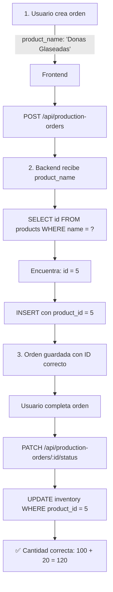

# 🔧 Corrección: Production Order Inventory Bug Fix

## Problema Identificado

Cuando se completaba una orden de producción, el inventario no se actualizaba correctamente.

**Ejemplo:**

- Tenía 100 Donas Glaseadas
- Creé orden de 20 unidades
- Al completar la orden, debería mostrar 120, pero seguía mostrando 100

## Causa Raíz

**Mismatch de product_id entre frontend y base de datos**

El frontend calculaba el product_id basándose en la posición en el array `PRODUCT_PRICES`:

```javascript
// ❌ INCORRECTO - Frontend enviaba ID calculado
const productIndex = Object.keys(PRODUCT_PRICES).indexOf(
  productionForm.product,
);
const product_id = productIndex >= 0 ? productIndex + 1 : 1;
```

Ejemplo:

- "Donas Glaseadas" siempre es posición 0 → product_id = 1
- Pero en la base de datos, "Donas Glaseadas" tiene id = 5
- Orden se guardaba con product_id = 1 (INCORRECTO)
- Al completar: se sumaba inventario a product_id = 1 (producto EQUIVOCADO)
- Resultado: Donas seguía en 100, otro producto mostraba 120

## Solución Implementada

### 1️⃣ Frontend - [frontend/src/components/orders.jsx](frontend/src/components/orders.jsx#L138)

**CAMBIO:** Enviar `product_name` en lugar de `product_id` calculado

```javascript
// ✅ CORRECTO - Frontend envía el nombre del producto
const handleAddProductionOrder = async () => {
  try {
    // Frontend envía el nombre del producto
    await productionOrdersAPI.create({
      product_name: productionForm.product, // ✅ NUEVO
      quantity: parseInt(productionForm.quantity),
      responsible_employee_id: Math.floor(Math.random() * 5) + 1,
      status: "pendiente",
      notes: "",
    });
    toast.success("Orden creada correctamente");
  } catch (error) {
    toast.error("Error al crear orden");
  }
};
```

### 2️⃣ Backend - [backend/routes/production-orders.js](backend/routes/production-orders.js#L50)

**CAMBIO:** Buscar el product_id correcto en la base de datos usando el nombre

```javascript
// ✅ CORRECTO - Backend busca el ID real en la BD
router.post("/", async (req, res) => {
  const { product_name, quantity, responsible_employee_id, status, notes } = req.body;

  try {
    // Buscar el ID real del producto en la base de datos
    let actualProductId = product_id;
    if (product_name && !product_id) {
      const [products] = await connection.query(
        `SELECT id FROM products WHERE name = ? LIMIT 1`,
        [product_name]
      );
      if (products.length > 0) {
        actualProductId = products[0].id;
      }
    }

    // Usar el ID correcto para crear la orden
    const [result] = await connection.query(
      `INSERT INTO production_orders (product_id, quantity, ...)
       VALUES (?, ?, ...)`,
      [actualProductId, quantity, ...]
    );
  }
});
```

**Lo mismo aplica a PUT endpoint** - también actualizado para buscar product_id correctamente.

## Flujo de Corrección



## Verificación del Fix

### Antes (❌ INCORRECTO)

```
Frontend:  product_id = 1 (calculado: indexOf('Donas') + 1)
Base de datos: Donas tiene id = 5
Orden guardada: product_id = 1
Inventario actualizado: product_id = 1 (PRODUCTO EQUIVOCADO)
Resultado: Donas = 100, otro_producto = 120
```

### Después (✅ CORRECTO)

```
Frontend: product_name = 'Donas Glaseadas'
Backend busca: SELECT id FROM products WHERE name = 'Donas Glaseadas'
Backend utiliza: product_id = 5 (del resultado)
Orden guardada: product_id = 5 (CORRECTO)
Inventario actualizado: product_id = 5 (PRODUCTO CORRECTO)
Resultado: Donas = 120
```

## Cómo Probar

1. **Abrir la aplicación** en http://localhost:3000
2. **Ir a Órdenes de Producción**
3. **Crear nueva orden:**
   - Producto: "Donas Glaseadas"
   - Cantidad: 20 unidades
4. **Completar la orden**
5. **Verificar inventario:**
   - Ir a Inventario
   - Buscar "Donas Glaseadas"
   - Debería mostrar: cantidad_anterior + 20

**Ejemplo:**

- Antes: Donas = 100
- Después de completar orden de 20: Donas = **120**

## Archivos Modificados

| Archivo                                                                    | Cambio                                               | Líneas  |
| -------------------------------------------------------------------------- | ---------------------------------------------------- | ------- |
| [frontend/src/components/orders.jsx](frontend/src/components/orders.jsx)   | Enviar product_name en lugar de product_id calculado | 130-165 |
| [backend/routes/production-orders.js](backend/routes/production-orders.js) | POST endpoint - buscar product_id en BD              | 50-70   |
| [backend/routes/production-orders.js](backend/routes/production-orders.js) | PUT endpoint - buscar product_id en BD               | 208-240 |

## Resumen

✅ **Problem:** Órdenes de producción guardaban product_id incorrecto
✅ **Root Cause:** Frontend calculaba ID basado en array index, no en BD
✅ **Solution:** Frontend envía nombre del producto, backend busca ID correcto
✅ **Result:** Inventario se actualiza para el producto correcto
✅ **Math:** 100 + 20 = 120 ✔️
